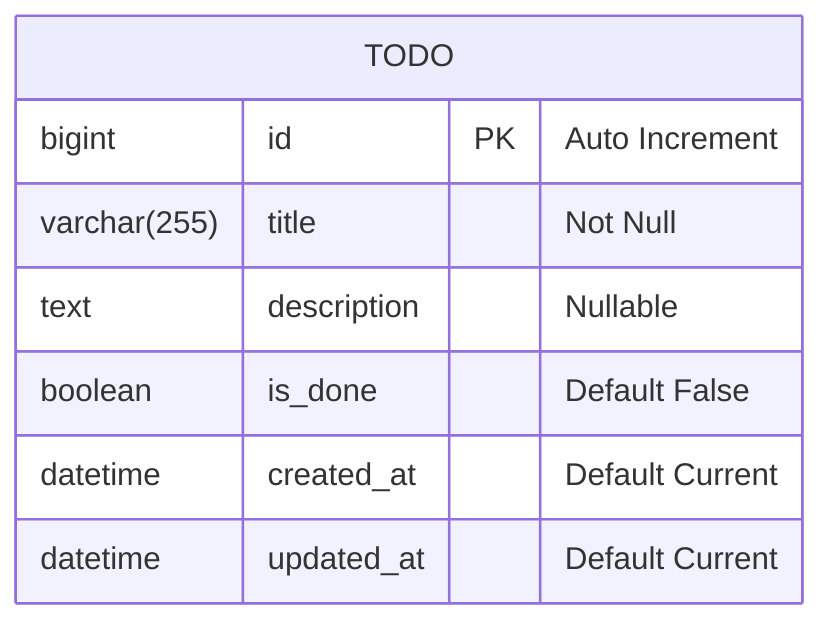

# BE 구제 과제 (2026-1)

# Introduction

KWEB 2026년 1학기 BE 준회원 승급 구제 과제의 주제는 **할 일 관리(To-Do) 플랫폼**입니다. 이번 과제의 목표는 Express.js와 데이터베이스를 연동하여, 할 일을 기록·조회·수정·삭제할 수 있는 간단한 웹 백엔드 API를 구현하는 것입니다.

이 과제는 **폴더 구조, 파일 이름, API 명세, 응답 형식까지 최대한 구체적으로 지정**되어 있습니다. 문서에 적힌 구조를 그대로 따라 구현하면 됩니다. 명세를 벗어나 자유롭게 확장하는 것도 가능하지만, 채점은 아래에 명시된 필수 요구사항을 기준으로 이루어집니다.

또한 이번 과제는 **Git 협업 흐름(Fork → 구현 → PR)** 까지 함께 테스트합니다. 제공된 템플릿 저장소를 Fork 하여 작업하고, 완료 후 원본 저장소로 PR을 생성하는 방식으로 제출합니다.

> 이번 과제에서는 로그인/회원가입, 인증, 배포를 요구하지 않습니다. 상태 관리 없이 쾌적한(?) 과제 풀이를 즐겨주세요.

# Specification

웹 백엔드 구현 과제입니다. 아래 명세에 맞는 URL 라우팅, API 기능 구현, 데이터베이스 테이블 생성과 쿼리 작성으로 백엔드를 구현해 주세요.

프론트엔드 페이지는 구현할 필요가 없습니다. 채점은 각 API로 HTTP 요청을 보내고, 백엔드 서버가 반환하는 HTTP 응답(상태 코드 + 응답 본문)을 확인하는 방식으로 진행됩니다.

이번 과제의 필수 기술 스택은 다음과 같습니다.

- **런타임/프레임워크:** Node.js + **Express.js** (필수)
- **데이터베이스:** MySQL (Codespace에 이미 구축되어 있습니다)
- **작업 환경:** 스터디와 동일한 방법으로 Github Codespace에서 작업합니다. 

## 이번 과제의 3가지 핵심 목표

이 과제는 다음 세 가지를 직접 구현해 보는 것이 핵심입니다. 채점도 이 세 가지를 중심으로 이루어집니다.

1. **Express.js + MySQL 연동** — 데이터베이스에 실제로 데이터를 저장하고 조회합니다.
2. **미들웨어 적용** — 로깅 / 유효성 검사 / 중앙 에러 처리 미들웨어를 직접 만들어 적용합니다.
3. **3-Layered Architecture 적용** — 라우팅·비즈니스 로직·DB 접근을 계층으로 분리합니다.

## DB Schema

이번 과제에는 사용자(User) 개념이 없습니다. `TODO` 테이블 하나만 사용합니다. 아래 스키마를 그대로 사용해 주세요.



테이블 생성 쿼리 예시 (그대로 사용 가능):

```sql
CREATE TABLE todo (
    id          BIGINT       NOT NULL AUTO_INCREMENT,
    title       VARCHAR(255) NOT NULL,
    description TEXT         NULL,
    is_done     BOOLEAN      NOT NULL DEFAULT FALSE,
    created_at  DATETIME     NOT NULL DEFAULT CURRENT_TIMESTAMP,
    updated_at  DATETIME     NOT NULL DEFAULT CURRENT_TIMESTAMP ON UPDATE CURRENT_TIMESTAMP,
    PRIMARY KEY (id)
);
```

## [필수] 폴더 구조

```
src/
├── index.js                  # 서버 실행 (app.listen)
├── app.js                    # Express 앱 생성, 미들웨어/라우터 등록
├── config/
│   └── db.js                 # MySQL 연결 설정
├── routes/                   # [Presentation] URL과 컨트롤러를 연결하는 라우팅만
│   └── todo.route.js
├── controllers/              # [Presentation] req에서 값을 꺼내고 res로 응답만 (로직 X)
│   └── todo.controller.js
├── services/                 # [Business] 실제 로직, 유효성 판단, 흐름 제어
│   └── todo.service.js
├── repositories/             # [Data Access] MySQL 쿼리만 실행 (res 사용 X)
│   └── todo.repository.js
└── middlewares/
    ├── logger.middleware.js  # 요청 로깅
    ├── validate.middleware.js# 요청 body 유효성 검사
    └── error.middleware.js   # 중앙 에러 처리
```

### 각 계층의 역할 (반드시 지켜주세요)

- **routes** : URL 경로와 컨트롤러 함수를 연결하기만 합니다.
- **controllers** : `req`에서 필요한 값(파라미터, body)을 꺼내 service에 넘기고, service의 결과를 `res`로 응답합니다. **DB 쿼리나 비즈니스 로직을 두지 않습니다.**
- **services** : 실제 로직을 담당합니다. "존재하지 않는 할 일이면 에러", "title이 없으면 에러" 같은 판단을 여기서 합니다. repository를 호출합니다.
- **repositories** : MySQL 쿼리만 실행하고 결과를 반환합니다. **`res.json()` 같은 응답 코드를 두지 않습니다.**

> Controller에 SQL이 있거나, Repository에서 응답(`res`)을 보내는 등 **계층이 섞이면 감점**됩니다. "각 파일이 자기 역할만 한다"가 핵심입니다.

## [필수] 공통 응답 형식

모든 API 응답은 아래 형식을 따라 주세요.

```json
// 성공
{ "success": true, "data": { ... } }

// 실패
{ "success": false, "message": "에러에 대한 설명" }
```

## [필수] API 명세


### `GET /todos` 할 일 목록 조회

- 모든 할 일을 배열로 반환합니다.
- 성공 시 `200 OK`

```json
{
  "success": true,
  "data": [
    { "id": 1, "title": "장보기", "is_done": false },
    { "id": 2, "title": "운동하기", "is_done": true }
  ]
}
```

### `GET /todos/:id` 특정 할 일 조회

- `:id`에 해당하는 할 일의 전체 내용을 반환합니다.
- 성공 시 `200 OK`
- 해당 `id`의 할 일이 없으면 `404 Not Found`

### `POST /todos` 할 일 생성

- 요청 body: `title`(필수), `description`(선택)
- `title`이 없거나 빈 문자열이면 `400 Bad Request`
- 성공 시 `201 Created` (생성된 할 일 반환)

```json
// 요청 body 예시
{ "title": "과제 제출하기", "description": "구제 과제 마감 전까지" }
```

### `PATCH /todos/:id` 할 일 수정

- 요청 body: `title`, `description`, `is_done` (일부만 보낼 수도 있음)
- 성공 시 `200 OK` (수정된 할 일 반환)
- 잘못된 값이면 `400 Bad Request`
- 해당 `id`의 할 일이 없으면 `404 Not Found`

### `DELETE /todos/:id` 할 일 삭제

- 성공 시 `204 No Content`
- 해당 `id`의 할 일이 없으면 `404 Not Found`

### `GET /` 스터디 회고 페이지 (HTML 반환)

이 엔드포인트만은 JSON이 아니라 **HTML**을 반환합니다. `res.json()`이 아닌 **`res.send()`** 로 HTML 문자열을 직접 반환하세요.

브라우저로 배포 주소의 `/`에 접속했을 때, 아래 내용이 담긴 간단한 HTML 페이지가 보여야 합니다. **반드시 본인의 언어로** 작성해 주세요.

- 이번 백엔드 스터디를 통해 **무엇을 배웠고, 무엇을 얻었는지**
- 스터디에서 배운 것 중 **본인이 가장 중요하다고 생각하는 개념 3가지**와, 각각 왜 중요하다고 생각하는지

HTML 구조는 자유입니다. `<h1>`, `<ul>`, `<p>` 정도만 사용해도 충분합니다. 디자인은 채점 대상이 아니며, 내용이 본인의 경험에 근거해 성실하게 작성되었는지를 봅니다.
(이과식 디자인 환영합니다)

```js
// controller 예시 (형식 참고용)
res.send(`
  <h1>내가 이 스터디에서 배운 것</h1>
  <p>...</p>
  <h2>가장 중요하다고 생각하는 개념 3가지</h2>
  <ul>
    <li>...</li>
  </ul>
`);
```

## [필수] 미들웨어 (3종)

아래 3개의 미들웨어를 **직접 작성**하여 적용해 주세요. 외부 라이브러리로 대체하지 말고 구조를 이해하며 만들어 보는 것이 목표입니다.

1. **로깅 미들웨어 (`logger.middleware.js`)**
   - 들어오는 모든 요청에 대해 `[HTTP메서드] 요청경로` 를 콘솔에 출력합니다.
   - 예: `[GET] /todos`

2. **유효성 검사 미들웨어 (`validate.middleware.js`)**
   - `POST /todos` 요청에서 `title`이 비어 있으면 다음 로직으로 넘어가지 않고 `400`을 반환합니다.
   - 이 검사를 라우터 단계에서 미들웨어로 적용해 보세요.

3. **중앙 에러 처리 미들웨어 (`error.middleware.js`)**
   - 컨트롤러/서비스에서 발생한 에러를 `next(err)`로 넘기면, 이 미들웨어 한 곳에서 받아 응답 형식에 맞게 처리합니다.
   - 모든 라우터 등록 이후 가장 마지막에 `app.use()`로 등록합니다.

# Assignment Policy

아래 감점 요인이 있을 경우 감점합니다.

- 심각한 기능상의 문제가 있을 시 (기능 누락, API 명세 미준수 등) — **5점 감점**
- 3-Layered Architecture 미준수 (계층 혼재, 폴더 구조 불일치) — **5점 감점**
- 미들웨어 3종 중 미구현 항목 — **각 3점 감점**
- 응답 형식 / 상태 코드 불일치 등 사소한 문제 — **3점 감점**
- 데이터베이스 연동이 아닌 방식(메모리 배열 등)으로 저장 시 — **5점 감점**
- `GET /` 회고 페이지 미구현 또는 `res.send`로 HTML을 반환하지 않을 시 — **5점 감점**
- 회고 내용이 본인의 경험에 근거하지 않고 형식적으로만 채워진 경우 — **3점 감점**
- Fork & PR 흐름을 따르지 않은 경우 — **3점 감점**

**통과 기준: 전체 15점 이하 감점**

# 제출 방법

이번 과제는 **Git Fork & PR** 흐름으로 제출합니다. 아래 순서를 따라 주세요.

1. 제공된 템플릿 저장소를 본인 계정으로 Fork 합니다.
2. Fork 한 저장소를 clone 하여, 지정된 폴더 구조 위에서 과제를 구현합니다.
3. 구현이 끝나면 본인의 fork에서 **원본 템플릿 저장소로 Pull Request**를 생성합니다.
4. PR 설명(description)에 아래 내용을 작성합니다.
   - 구현하면서 내린 주요 설계 결정(예: 어떤 계층에 어떤 로직을 두었는지)
   - 구현 중 막혔던 부분과 어떻게 해결했는지

> 리뷰어가 PR에 코멘트로 코드나 설계에 대해 되물을 수 있습니다. 본인이 작성한 코드는 스스로 설명할 수 있어야 합니다.

# 주의사항

> 채점은 채점자의 환경에서 직접 서버를 실행하여 진행됩니다. **채점자의 환경에서 실행이 불가능할 경우 FAIL로 간주**합니다. 제출 전 반드시 실행 테스트를 해보고 제출해 주세요.

> 이번 과제에서 생성형 AI의 사용은 허용되나, 사용한 부분과 프롬프트를 README.md에 정확하게 명시해 주시기 바랍니다.

> 마감일 이후에 제출된 과제(재제출 포함)는 채점하지 않습니다. 재제출을 원하는 경우 미리 제출해 주세요.
